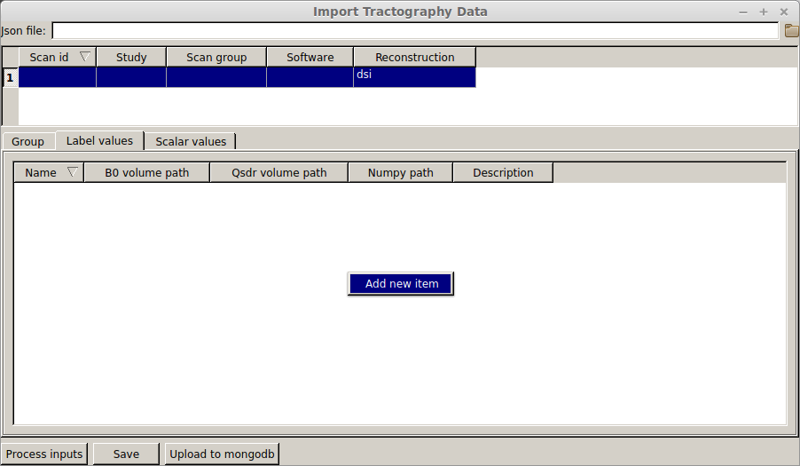
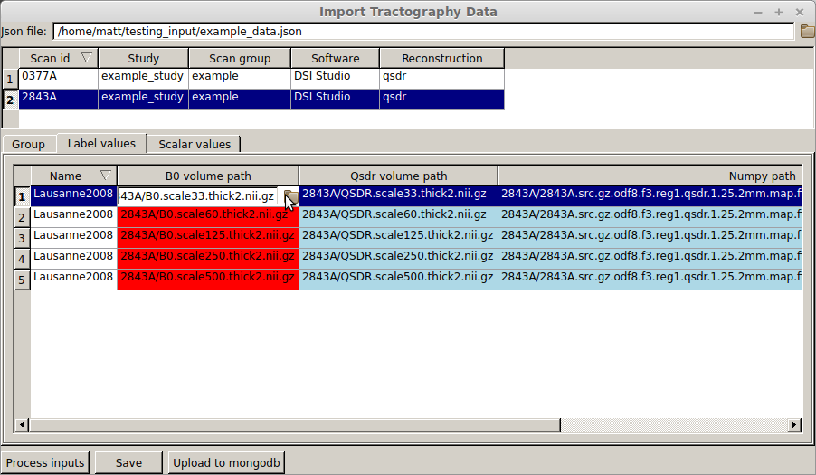

Importing your data
====================

Suppose you have completed the following steps

1. You ran QSDR reconstruction *with "save mapping" selected*
2. You saved a .trk file from the output from (1) 
3. You have a brain atlas aligned to the b0 volume used to create QSDR.
   *This volume must be interpolated to the SAME grid as the b0 volume*

You can launch the data importer from your shell

.. code-block:: bash

  $ dsi2_import

and will see the following screen

.. figure:: ../_static/import_add_blank.png
   :scale: 80%
   :alt: data importer
   :align: center

To access the "add new item", right click in the white space.  A new subject metadata
input panel will appear below

.. figure:: ../_static/label_importer.png
   :scale: 20%
   :alt: label importer
   :align: center

A giant arrow points to a tab where you can add each of the atlases you've aligned to 
the b0 volume

Add a new atlas by right clicking in the whitespace.  Your b0-aligned atlases will be
warped to QSDR space using the voxel mapping in the ``fib.gz`` file. Here is an example

The color coding is important in the cells of this sheet.  If a cell is red, it means that
the current value does not point to an existing file and that this file MUST exist for data
to be successfully imported.  Blue cells indicate that the file does not yet exist, but will
be created during the import process.  White cells mean that the file exists on your filesystem.

Once all your cells are white or blue, you can click the **Process inputs** button to create any
files needed for import. Once all the cells are white, you can click the **Save** button to write
out a json file that can be loaded locally OR the **Upload to mongodb** if you have a local 
mongodb instance running.

